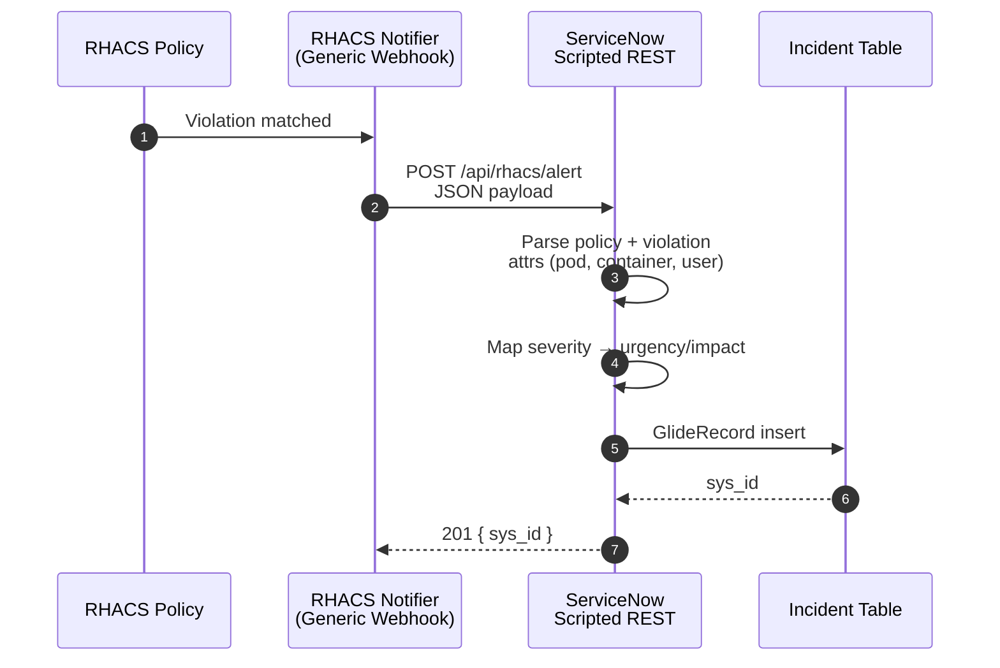

  

RHACS policy violation fires. ServiceNow Incident opens. One Scripted REST
handler in the middle turns the RHACS payload into a populated Incident with
severity-mapped urgency/impact, policy context, and the exact workload that
tripped.

## Pick A Starting Point

  <a class="rhacs-decision-card" href="{{ '/documentation-map.html' | relative_url }}">
    I know my problem, not the page
    Documentation Map
    Intent-first table routing operator problems to the correct page.
  </a>
  <a class="rhacs-decision-card" href="{{ '/capabilities.html' | relative_url }}">
    I am evaluating fit
    Capabilities
    What the integration does, what it deliberately does not do, decision boundaries.
  </a>
  <a class="rhacs-decision-card" href="{{ '/setup-servicenow.html' | relative_url }}">
    I am installing the receiver
    ServiceNow Setup
    Scripted REST API + Resource definition and ACL requirements.
  </a>
  <a class="rhacs-decision-card" href="{{ '/setup-rhacs.html' | relative_url }}">
    I am configuring the sender
    RHACS Setup
    Generic Webhook notifier and policy attachment on the RHACS side.
  </a>
  <a class="rhacs-decision-card" href="{{ '/use-case-exec-into-pod.html' | relative_url }}">
    I want a real workflow
    Exec-into-Pod Triage
    Concrete end-to-end flow from exec violation to assigned SNOW Incident.
  </a>
  <a class="rhacs-decision-card" href="{{ '/reference-handler-script.html' | relative_url }}">
    I am reading the handler
    Handler Script Reference
    Field-by-field behavior of <code>scripts/acs-alert.js</code>.
  </a>

## How The Integration Shapes Up

## Operating Model At A Glance

| Layer            | Responsibility                                                                 |
| ---------------- | ------------------------------------------------------------------------------ |
| RHACS policy     | Detects violation and triggers attached notifier                                |
| RHACS notifier   | POSTs JSON payload to ServiceNow endpoint                                       |
| Scripted REST    | Parses payload, builds description, maps severity, writes Incident              |
| Incident table   | Holds short_description, description, urgency, impact                           |

Narrow on purpose. No queue, no dedup store, no retry layer baked in. See
[Capabilities]({{ '/capabilities.html' | relative_url }}) for what the
integration refuses and where to extend.

## Page Families

- Setup: [ServiceNow]({{ '/setup-servicenow.html' | relative_url }}) · [RHACS]({{ '/setup-rhacs.html' | relative_url }})
- Reference: [Handler Script]({{ '/reference-handler-script.html' | relative_url }}) · [Webhook Payload]({{ '/reference-webhook-payload.html' | relative_url }}) · [Incident Fields]({{ '/reference-incident-fields.html' | relative_url }})
- Capabilities: [Decision boundaries]({{ '/capabilities.html' | relative_url }})
- Practical use cases: [Exec-into-Pod]({{ '/use-case-exec-into-pod.html' | relative_url }}) · [Severity mapping]({{ '/use-case-severity-mapping.html' | relative_url }}) · [Dedup + storm control]({{ '/use-case-dedup-storm-control.html' | relative_url }})

## External Reference

- <a href="https://www.redhat.com/en/blog/how-integrate-red-hat-advanced-cluster-security-kubernetes-servicenow">Red Hat blog: ServiceNow + RHACS via Generic Webhook</a>
- <a href="https://docs.redhat.com/en/documentation/red_hat_advanced_cluster_security_for_kubernetes/4.9/html/integrating/integrate-with-servicenow#webhook-configuring-acs_integrate-with-servicenow">RHACS 4.9 product docs: Generic Webhooks</a>
- <a href="https://developer.servicenow.com/dev.do#!/home">ServiceNow Developer Instance</a>
