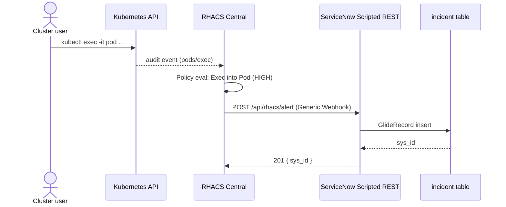

# Use Case: Exec-into-Pod Triage

Classic "someone shelled into a prod pod" signal. Low volume, high context,
cheap to triage — the right policy to start with.

## Problem

Your cluster RBAC allows `pods/exec`. You want every interactive shell
session on a production workload to produce an Incident with enough context
for SecOps to decide within 60 seconds whether to escalate.

## Trigger

RHACS policy `Kubernetes Actions: Exec into Pod` fires on the audit event
emitted when the Kubernetes API receives a `pods/exec` request.

Reproduce in a lab cluster:

```bash
oc exec -n gibson garbage -c kserve-container -- /bin/bash
```

Any `exec` against a matching namespace/deployment triggers the policy.

## Flow



## Expected Incident

The payload in [Webhook Payload Reference]({{ '/reference-webhook-payload.html' | relative_url }}#realistic-exec-into-pod-payload) produces:

| Field              | Value                                                                              |
| ------------------ | ---------------------------------------------------------------------------------- |
| `short_description`| `ACS policy violation: Kubernetes Actions: Exec into Pod (HIGH_SEVERITY)`          |
| `urgency`          | `1 High`                                                                           |
| `impact`           | `2 Medium`                                                                         |
| `priority`         | `2 High` (derived)                                                                 |
| `description`      | See below                                                                          |

Description body:

```text
Source: Red Hat Advanced Cluster Security (ACS)
Policy: Kubernetes Actions: Exec into Pod (HIGH_SEVERITY)
Policy description: Alerts when Kubernetes API receives request to execute command in container
Rationale: 'pods/exec' is non-standard approach for interacting with containers.
Remediation: Restrict RBAC access to the 'pods/exec' resource.

Cluster: local-cluster
Workload: Deployment / gibson-deployment
Namespace: gibson
Pod: garbage
Container: kserve-container
Command: /bin/bash
User: zero-cool
Groups: ocp-admins, system:authenticated:oauth, system:authenticated
Event time: 2026-02-12T15:22:22.276480996Z

Violation:
Kubernetes API received exec '/bin/bash' request into pod 'garbage' container 'kserve-container'
```

## Triage Checklist

Order designed for a 60-second scan by an analyst new to the cluster.

1. **User** — is it a known human (breakglass, admin) or a service account?
2. **Groups** — does the user actually hold `ocp-admins` or was this an
   unexpected group?
3. **Namespace + Workload** — production tier or lab?
4. **Command** — `/bin/bash`, `sh`, or something suspicious
   (`nsenter`, `chroot`, `base64 -d | sh`)?
5. **Event time** vs. change-window calendar — was a deploy or incident
   active?

If all five are green → close as "authorized access, no action".
If any red → escalate, attach the Incident to a SIR ticket, pull the audit
log window for the same user ± 10 minutes.

## Why This Policy First

| Property          | Value for onboarding                                           |
| ----------------- | -------------------------------------------------------------- |
| Volume            | Low (only humans + break-glass paths)                          |
| Signal            | High (direct evidence of interactive access)                   |
| Context required  | Complete — cluster, user, groups, command all present          |
| False positive cost | Low — easy to close, rare enough to not cause fatigue        |

Compare to a CVE-based policy: high volume, low per-event actionability,
very painful without dedup in place.

## Boundaries

- The handler reads `violations[0]` only. If the same alert carries multiple
  exec events (rare), only the first shows in the Incident.
- `commands` is a single string — multi-arg commands appear space-joined.
- `Groups` is a single string — list is comma-separated, not a reference.

If you need one Incident per exec event, see
[Dedup + Storm Control]({{ '/use-case-dedup-storm-control.html' | relative_url }})
for the reverse problem (collapsing repeats) and invert the logic.

## Related

- [RHACS Setup]({{ '/setup-rhacs.html' | relative_url }}) — attach the policy
- [Handler Script Reference]({{ '/reference-handler-script.html' | relative_url }}) — field mapping
- [Webhook Payload Reference]({{ '/reference-webhook-payload.html' | relative_url }}) — exact JSON shape
